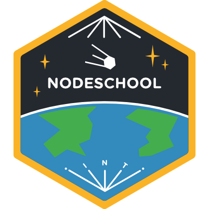

# Nodeschool | 2015-05-22

## Tonight's featured workshopper

- [lololodash](https://github.com/mdunisch/lololodash) -
  [lodash](https://lodash.com/) is a JavaScript utility library
  delivering consistency, modularity, performance, & extras.

## News

- [The State of Node for the Enterprise](http://marketing.nodesource.com/acton/fs/blocks/showLandingPage/a/15680/p/p-0012/t/page/fm/5)

## Attendance

Comment on [tonight's attendence issue](https://github.com/nodeschool/dallas/issues/53)

## Stickers

Complete a workshopper or create an exercise, get the new Dallas sticker!

Or choose an International Day sticker from last month's event.

## Tonight's Sponsor

Thanks as always to [Credera](http://www.credera.com) for food and drinks!

