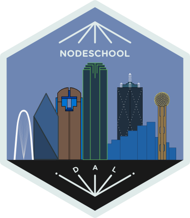

# Nodeschool | 2016-01-20

## Tonight's featured workshopper

- [Make Me Hapi](https://www.npmjs.com/package/makemehapi)
 - `npm update -g makemehapi` - 2 patch releases since last meetup.

## News

## Attendance

Comment on [tonight's attendence issue](https://github.com/nodeschool/dallas/issues/71)

## Stickers

Complete a workshopper or create an exercise, get a sticker from our collection!

## Tonight's Sponsor

Thanks to [Vinli](http://www.vin.li) for food, drinks, stickers and venue!

